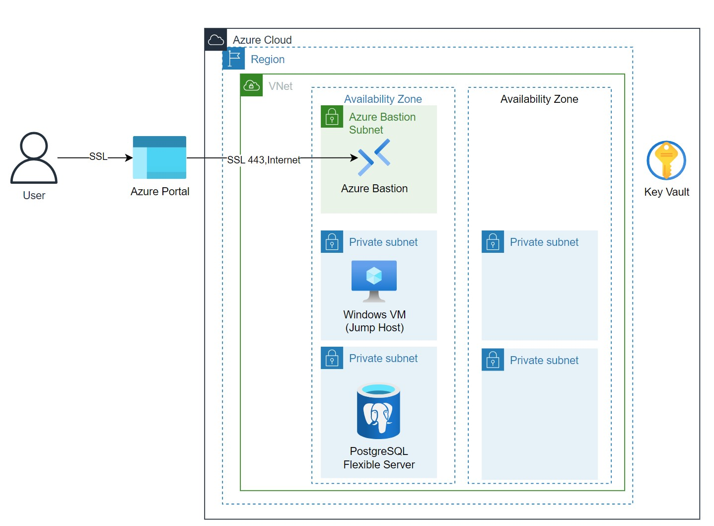

# 🌐🐘 Azure PostgreSQL Flexible Server with VNet Integration using Terraform

## 📚 Introduction 

This repository provides Terraform code for deploying an Azure PostgreSQL Flexible Server with full VNet integration for enhanced security and data integrity.

## Architecture Diagram :building_construction:


## 🛠️ Prerequisites

- **Azure Subscription**
- **Terraform v0.14 or later**
- **Azure CLI**
- **Git**

## 📋 Instructions for Deployment

### 1. **Clone Repository**

```bash
git clone https://github.com/YourOrg/your_repo.git
cd your_repo
```

### 2. **Initialize Terraform**

```bash
terraform init
```

### 3. **Plan Deployment**

```bash
terraform plan
```

### 4. **Apply Deployment**

```bash
terraform apply
```

## 🧐 Validate Deployment

Check the Azure portal to ensure that the PostgreSQL Flexible Server and associated resources are successfully deployed.

## 🤝 Contribute

Feel free to contribute to this project by opening a pull request or submitting an issue.

## ℹ️ Additional Information

For more information on Azure PostgreSQL Flexible Server, see [Azure Documentation](https://docs.microsoft.com/azure/postgresql/flexible-server).

## 👩‍💼 Authors

- [Derek Nguyen](mailto:dereknguyen@example.com)

## 📝 License

This project is licensed under the MIT License - see the [LICENSE.md](LICENSE.md) file for details.
